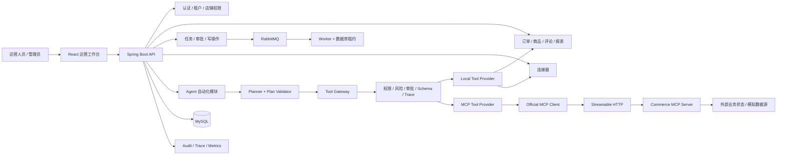

# ShopOps

> 面向多店铺电商运营场景的企业级全栈运营平台。  
> ShopOps 以 Spring Boot 业务平台为主体，将 Agent 作为受权限、审批、幂等、事务和审计约束的自动化工作流模块嵌入系统，并通过 MCP 接入独立的远程工具服务。

当前仓库用于工程实践、作品集和面试演示。外部电商平台主要通过公开数据文件、Webhook、模拟适配器和独立 MCP Server 接入，尚未连接真实商业店铺与生产流量。

---

## 1. 项目定位

ShopOps 不是聊天机器人 Demo，也不是仅由 LLM 驱动的工具调用样例。

它解决的是多店铺运营平台中的两个核心问题：

1. **业务平台如何管理店铺、订单、商品、评论、报表、审批、连接器和组织权限；**
2. **Agent 如何在不绕过权限、审批和业务状态机的前提下安全执行运营任务。**

在 ShopOps 中，Agent 可以：

- 理解自然语言运营目标；
- 选择受控工作流；
- 生成并校验执行计划；
- 通过统一 Tool Gateway 调用本地工具或远程 MCP 工具；
- 汇总证据并生成运营报告；
- 对高风险写操作发起人工审批；
- 在失败、超时和外部状态不确定时进入可诊断状态。

Agent 不可以：

- 自行切换租户或店铺；
- 提升权限；
- 绕过审批；
- 修改风险策略；
- 把模型输出当作外部写操作成功；
- 在远程工具 Schema 发生变化后继续盲目执行。

---

## 2. 目标用户与核心场景

目标用户包括多店铺运营人员、运营主管和平台管理员。

当前代码覆盖的主要场景：

- 查看店铺经营指标、订单汇总、差评与商品候选；
- 生成经营日报、Excel 报表，并可选同步到飞书 Webhook；
- 通过自然语言创建和跟踪 Agent 自动化任务；
- 对退款执行、商品标题修改等高风险操作进行人工审批；
- 管理连接器、凭据、工具、Prompt、模型配置、任务和审计事件；
- 通过租户、店铺成员关系、角色、权限点和数据范围限制访问；
- 通过独立 Commerce MCP Server 提供远程电商工具；
- 在 MCP 工具 Schema 漂移时阻止真实调用。

---

## 3. 技术栈

| 层次 | 技术 |
|---|---|
| 后端 | Java 17、Spring Boot 3.3.7、Spring MVC、MyBatis |
| 数据库 | MySQL 8.4、Flyway V1—V21 |
| Agent | 工作流模板、Planner、Plan Validator、Tool Gateway、Verifier |
| MCP | MCP Java SDK、Streamable HTTP、独立 Commerce MCP Server |
| 写操作可靠性 | 状态机、幂等键、Input Hash、TransactionTemplate、Outbox |
| 异步 | RabbitMQ、数据库任务状态、租约与重试字段 |
| 缓存与基础设施 | Redis 依赖、健康检查 |
| 前端 | React 19、TypeScript 5.7、Vite 6、Ant Design、Axios、ECharts |
| 可观测性 | Actuator、Micrometer、Prometheus 配置、MDC、Trace、Audit |
| 测试 | JUnit 5、Spring Boot Test、Mockito、Testcontainers 依赖、Agent Evaluation |
| 部署 | Dockerfile、Docker Compose、GitHub Actions |

项目采用**模块化单体 + 独立 MCP Server**。核心业务保持清晰事务边界，远程工具能力通过 MCP 独立部署，避免过早拆分大量微服务。

---

## 4. 仓库结构

```text
shopops-common/                  公共契约、返回模型与 MCP 共享定义
shopops-commerce-mcp-server/     独立 Commerce MCP Server
shopops-admin/                   Spring Boot 管理端、业务后端与 Agent Runtime
shopops-admin-ui/                React/TypeScript 运营工作台
docs/                            架构、演示、评测和阶段交付文档
deploy/                          Docker、Compose 与 Prometheus 配置
performance/                     k6 性能脚本
scripts/                         数据准备、启动、演示与静态校验脚本
sql/                             早期 SQL 基线，正式演进以 Flyway 为准
```

---

## 5. 系统架构



更多组件说明见：

- [`docs/architecture/shopops-architecture.md`](docs/architecture/shopops-architecture.md)
- [`docs/enterprise-upgrade/`](docs/enterprise-upgrade/)

---

## 6. 企业级 Agent 执行链路

一次自然语言任务的主要流程：

```text
用户输入
→ 可信身份与店铺上下文
→ 意图识别与任务类型选择
→ Planner 生成受控计划
→ Plan Validator 校验模板、工具、权限和风险
→ Tool Gateway
→ Provider 路由
   ├─ Local Tool Provider
   └─ MCP Tool Provider
→ 工具执行
→ Step 状态与证据聚合
→ Verifier
→ 报告生成
→ Task Result + Audit Timeline
```

当前支持的有限工作流模板：

- `daily_review`
- `comment_risk`
- `product_optimization`
- `ad_anomaly`

执行模式：

- `ADVISORY`：仅分析与建议；
- `DRAFT`：生成待确认草稿；
- `AUTOMATIC`：仅允许策略许可的低风险动作。

Plan Validator 会检查：

- 工作流模板；
- 工具白名单；
- 工具启用状态与版本；
- 当前用户权限；
- 风险等级；
- 最大步骤数；
- 自动模式审批限制。

---

## 7. 真实 MCP 集成

Phase 8 将部分工具从进程内 Java Executor 升级为独立 MCP 工具服务。

### 7.1 调用架构

```text
DefaultToolGatewayService
→ McpToolProvider
→ OfficialCommerceMcpClient
→ Streamable HTTP
→ Commerce MCP Server
→ MCP Tool
```

远程工具不会绕过平台治理。权限、风险策略、审批、输入校验、调用日志和 Trace 仍由统一 Tool Gateway 控制。

### 7.2 MCP 协议闭环

当前已真实验证：

```text
initialize
→ notifications/initialized
→ tools/list
→ tools/call
```

正常外部集成调用可以完成：

```text
Admin JVM
→ 独立 Commerce MCP Server JVM
→ comment.query_negative
→ 返回结构化结果
```

### 7.3 Schema Drift 防护

本地治理元数据保存批准过的工具 Schema Hash。

执行远程工具前：

```text
tools/list
→ 获取远程 inputSchema
→ Canonical JSON
→ SHA-256
→ 与本地批准 Hash 比较
→ 一致：允许 tools/call
→ 不一致：返回 MCP_TOOL_SCHEMA_MISMATCH
```

Schema Drift 测试中只会出现：

```text
initialize
tools/list
```

不会发生 `tools/call`。

### 7.4 MCP 错误分类

当前保留明确错误码：

```text
MCP_SERVER_DISABLED
MCP_CREDENTIAL_MISSING
MCP_CONNECT_TIMEOUT
MCP_CONNECT_FAILED
MCP_CALL_TIMEOUT
MCP_PROTOCOL_ERROR
MCP_TRANSPORT_ERROR
MCP_TOOL_NOT_DISCOVERED
MCP_SCHEMA_HASH_MISSING
MCP_TOOL_SCHEMA_MISMATCH
```

业务与治理异常会原样向上传递，不会被错误包装为通用 Transport Error。

---

## 8. 多租户、权限与治理

可信请求上下文包含：

```text
tenantId
userId
accessibleShopIds
currentShopId
roles
permissions
requestId
traceId
```

主要约束：

- Bearer Token 提供身份基础；
- 后端重新核验当前用户和店铺成员关系；
- 前端传入的 `shopId` 不是最终授权结果；
- 角色映射到细粒度权限点；
- Tool Gateway 在实际执行前再次授权；
- RabbitMQ Worker 使用持久化任务身份复核消息；
- HIGH / CRITICAL 工具不能通过店铺配置关闭审批；
- MCP Header 由可信服务端上下文生成，不直接接受模型伪造。

当前权限映射仍主要由代码维护，尚未形成完整数据库化 RBAC 管理界面。

---

## 9. 写操作、审批、事务与幂等

旗舰可靠性链路为：

```text
order.refund_execute
```

完整执行流程：

```text
Tool 请求
→ 权限与风险检查
→ 审批策略
→ 审批参数摘要校验
→ 幂等检查
→ WriteOperation 状态机
→ 外部退款适配器调用
→ 外部结果回查
→ 本地确认
→ Outbox
→ Audit / Trace
```

### 9.1 写操作状态机

```text
APPROVED
→ EXECUTING
→ EXTERNAL_SUCCEEDED
→ LOCAL_CONFIRMED
→ SUCCEEDED
```

异常状态可以进入：

```text
EXTERNAL_UNKNOWN
FAILED
NEEDS_MANUAL_ACTION
```

### 9.2 幂等语义

业务幂等键由以下信息组合：

```text
tool
tenant
shop
businessObject
operationRequestId
```

同时保存 `inputHash`：

- 相同幂等键、相同参数：复用已有操作；
- 相同幂等键、不同参数：拒绝执行；
- 数据库唯一键竞争后重新读取并校验 `inputHash`。

### 9.3 事务边界

`memory` 与 `jdbc` 模式在事务创建之前分流：

```text
memory
→ 直接运行内存状态机
→ 不访问 TransactionManager / Mapper / Outbox

jdbc
→ TransactionTemplate.execute(...)
→ 状态更新、幂等记录和 Outbox 同事务提交
```

该设计避免了声明式 `@Transactional` 在进入方法体前提前获取 JDBC Connection，从而保证内存测试模式不依赖数据库，同时保留 JDBC 生产路径的事务语义。

当前退款外部客户端仍是确定性模拟适配器，不代表已接入真实平台退款 API。

---

## 10. 异步任务

任务状态：

```text
PENDING
→ QUEUED
→ RUNNING
   ├→ SUCCEEDED
   ├→ WAITING_APPROVAL
   ├→ RETRYING
   ├→ FAILED
   ├→ CANCEL_REQUESTED → CANCELLED
   └→ NEEDS_MANUAL_ACTION
```

Worker 通过数据库条件更新原子获取租约，并记录：

```text
workerId
lockedAt
leaseExpireAt
heartbeatAt
attempt
```

重复 RabbitMQ 消息不会仅凭消息到达就重复执行。

当前周期心跳、完整指数退避、DLQ 管理界面、审批后统一恢复和全步骤取消检查仍需继续完善。

---

## 11. 连接器

当前重点治理对象为：

```text
file.order-summary
```

同步流程：

```text
连接配置
→ 文件读取
→ 分页游标
→ 外部 ID 提取
→ SHA-256 内容指纹
→ 唯一键去重 / UPSERT
→ Checkpoint
→ 同步状态与调用日志
```

连接器凭据加密存储，API 不返回可恢复明文。

公开 Olist 数据用于演示，不等于真实店铺连接。

---

## 12. 可观测性

当前具备：

- MDC：`requestId`、`traceId`、`tenantId`、`shopId`、`userId`；
- Agent `TraceSpan`；
- Tool 调用日志；
- Connector 调用日志；
- Audit 事件；
- Actuator health、liveness、readiness、metrics、prometheus；
- Micrometer HTTP 与业务指标门面；
- Prometheus 示例配置。

MCP 调用会记录：

```text
method
serverCode
protocolVersion
remoteToolName
taskId
stepId
traceId
tenantId
shopId
userId
approvalId
```

当前尚未完成标准 OpenTelemetry 全链路传播，也没有经过生产验证的 Grafana Dashboard 和 Alertmanager 规则。

---

## 13. 测试与评测

Phase 8 已完成全量 Maven 回归：

```text
Tests run: 133
Failures: 0
Errors: 0
Skipped: 10
BUILD SUCCESS
```

Reactor 中以下模块全部通过：

```text
shopops
shopops-common
shopops-commerce-mcp-server
shopops-admin
```

### 13.1 覆盖范围

测试覆盖：

- 自然语言任务与 Daily Review；
- Agent Memory Flow；
- Model Planner 与 Model Report；
- Tool Gateway 权限与审批；
- MCP Server 不可达；
- MCP Schema Drift；
- 独立 MCP Server 外部调用；
- Evaluation Case；
- 写操作状态机；
- 幂等 Replay；
- `inputHash` 冲突；
- 内存模式 JDBC 零交互。

### 13.2 Agent Evaluation

普通 Evaluation：

```text
caseCount: 7
passedCaseCount: 7
mismatches: []
```

Model Evaluation：

```text
caseCount: 4
passedCaseCount: 4
mismatches: []
```

### 13.3 MCP 测试基础设施

默认离线测试使用 test-scope `InMemoryCommerceMcpClient`：

```text
DefaultToolGatewayService
→ McpToolProvider
→ InMemoryCommerceMcpClient
→ Schema Hash 校验
→ CommentRiskService
```

它只存在于 `src/test/java`：

- 不进入生产包；
- 不把 MCP 工具切回 Local Provider；
- 不绕过 Tool Gateway；
- 不绕过权限和 Schema Hash；
- 不依赖手工启动 8090 服务；
- 保证默认 `mvn clean test` 可离线稳定执行。

真实外部 MCP 测试则显式连接独立 Commerce MCP Server，验证真实协议闭环。

---

## 14. 本地运行

### 14.1 环境要求

- JDK 17
- Maven 3.9+
- Node.js 20+
- MySQL 8.4
- 可选：Redis、RabbitMQ、Docker Desktop

请确认 Maven 实际使用 Java 17：

```bash
mvn -version
```

### 14.2 全量测试

```bash
mvn clean test
```

### 14.3 后端打包

```bash
mvn clean package -DskipTests
```

生成：

```text
shopops-common/target/shopops-common-0.1.0-SNAPSHOT.jar
shopops-commerce-mcp-server/target/shopops-commerce-mcp-server-0.1.0-SNAPSHOT.jar
shopops-admin/target/shopops-admin-0.1.0-SNAPSHOT.jar
```

### 14.4 启动 Commerce MCP Server

PowerShell：

```powershell
$env:SHOPOPS_COMMERCE_MCP_TOKEN = "replace-with-local-token"
mvn -f .\shopops-commerce-mcp-server\pom.xml spring-boot:run
```

默认地址：

```text
http://127.0.0.1:8090/mcp
```

### 14.5 启动 Admin

```bash
mvn -f ./shopops-admin/pom.xml spring-boot:run -Dspring-boot.run.profiles=dev
```

### 14.6 前端

```bash
cd shopops-admin-ui
npm ci
npm run typecheck
npm run build
npm run dev
```

### 14.7 Docker 演示

```bash
docker compose -p shopops-demo -f deploy/docker-compose.demo.yml config
docker compose -p shopops-demo -f deploy/docker-compose.demo.yml up --build
```

演示 Secret 仅用于本地。生产环境必须显式提供安全配置。

---

## 15. 真实外部 MCP 测试

先启动 Commerce MCP Server：

```powershell
$env:SHOPOPS_COMMERCE_MCP_TOKEN = "phase8-test-token"
mvn -f .\shopops-commerce-mcp-server\pom.xml spring-boot:run
```

在另一个终端运行：

```powershell
mvn -pl shopops-admin -am test `
  "-Dtest=OfficialCommerceMcpClientExternalIntegrationTest,McpSchemaDriftExternalIntegrationTest" `
  "-Dsurefire.failIfNoSpecifiedTests=false" `
  "-Dshopops.mcp.integration.enabled=true" `
  "-Dshopops.mcp.integration.base-url=http://127.0.0.1:8090" `
  "-Dshopops.mcp.integration.token=phase8-test-token"
```

预期：

```text
Tests run: 2
Failures: 0
Errors: 0
Skipped: 0
BUILD SUCCESS
```

---

## 16. 前端与演示

React 工作台目前以以下能力为主导航：

- 运营总览；
- Agent 自动化工作台；
- 任务；
- 审批；
- 报告；
- 连接器；
- 工具；
- 审计；
- 组织管理。

推荐演示流程：

```text
运营人员发起自然语言任务
→ Agent 生成计划
→ 通过 MCP 查询差评
→ 生成运营报告
→ 发现高风险写操作
→ 创建人工审批
→ 审批后执行受控写操作
→ 查看 Trace 与 Audit
```

相关材料：

- [`docs/demo/flagship-workflow.md`](docs/demo/flagship-workflow.md)
- [`docs/architecture/shopops-architecture.md`](docs/architecture/shopops-architecture.md)
- [`docs/resume/shopops-resume-material.md`](docs/resume/shopops-resume-material.md)

---

## 17. 已知限制

- 尚未接入真实商业电商平台、真实商家账号或生产流量；
- 退款仍使用模拟外部适配器；
- Redis 尚未形成完整缓存、分布式锁或限流主链路；
- RabbitMQ 恢复、心跳、DLQ 和 Outbox 发布闭环仍需完善；
- 前端缺少完整订单、商品、评论业务页面和 E2E 测试；
- 权限点尚未完全数据库化；
- OpenTelemetry、告警规则和性能基线尚未完成生产验证；
- DRAFT 模式尚未形成完整独立的写操作草稿分支；
- Agent 的 Token/成本预算、通用 DAG 和分层 Verifier 仍有限；
- 外部 MCP 测试需要显式启动独立 Server，不属于默认离线单元回归。

---

## 18. 后续规划

后续优先级：

1. 完善旗舰演示链路和项目截图；
2. 补齐订单、商品、评论核心运营页面；
3. 完善 RabbitMQ、Outbox、DLQ 和故障恢复闭环；
4. 引入稳定的 OpenTelemetry Trace；
5. 建立真实性能基线与告警规则；
6. 接入电商平台沙箱 API；
7. 增加前端 E2E 测试。

当前阶段不再优先增加大量浅层工具，也不扩大 Agent 自主权限。

---

## 19. 当前完成状态

```text
真实 MCP Server：完成
Admin → MCP Server 双 JVM 调用：完成
initialize / tools/list / tools/call：完成
Schema Drift 阻断：完成
MCP 错误分类：完成
Tool Gateway 治理：完成
退款写操作状态机：完成
幂等 Replay 与 inputHash 校验：完成
Memory / JDBC 事务边界隔离：完成
Agent Evaluation：7/7
Model Evaluation：4/4
Maven 全量回归：133 tests，0 failures，0 errors
Maven 打包：完成
```

ShopOps 当前可视为一个以**企业业务平台为主体、以受治理 Agent 和 MCP 工具生态为自动化能力**的全栈工程项目。
