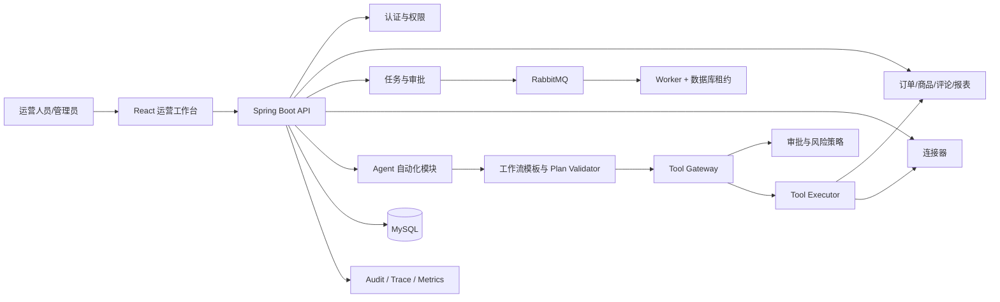

# ShopOps

ShopOps 是一个面向多店铺电商运营场景的全栈运营管理平台，覆盖组织、权限、店铺、订单、商品、评论、报表、连接器、异步任务、审批和审计追踪等核心能力；Agent 作为受权限、审批、幂等、预算和审计约束的自动化工作流模块嵌入平台。

> 当前仓库用于工程实践、作品集和面试演示。外部电商平台主要通过公开数据文件、Webhook 或模拟适配器接入，尚未接入真实商业店铺和生产流量。

## 1. 目标用户与业务场景

目标用户是负责多个店铺的运营、主管和平台管理员。当前代码覆盖的典型场景包括：

- 查看店铺经营指标、订单汇总、差评和商品候选；
- 生成经营日报、Excel 报表并可选同步到飞书 Webhook；
- 创建并跟踪 Agent 自动化任务；
- 对退款执行、商品标题修改等高风险工具进行人工审批；
- 管理连接器、凭据、任务、工具、审计事件、Prompt 和模型配置；
- 通过租户、店铺成员关系、角色权限点和数据范围限制访问。

## 2. 项目定位

ShopOps 的主体是企业运营工作台，而不是聊天 Agent Demo。

Agent 可以理解目标、选择受控工作流、生成计划、调用治理后的工具、汇总证据并生成建议或报告；Agent 不能自行切换租户/店铺、提升权限、绕过审批、修改风险策略或把模型判断当成外部写操作成功。

## 3. 技术栈

| 层次 | 实际技术 |
|---|---|
| 后端 | Java 17、Spring Boot 3.3.7、Spring MVC、MyBatis |
| 数据库 | MySQL 8.4、Flyway V1—V21 |
| 异步 | RabbitMQ；数据库任务状态与租约字段 |
| 缓存/基础设施 | Redis 依赖与健康检查，当前未形成完整业务缓存主链路 |
| 前端 | React 19、TypeScript 5.7、Vite 6、Ant Design、Axios、ECharts |
| 可观测性 | Spring Boot Actuator、Micrometer、Prometheus 配置、MDC、业务 Trace/Audit |
| 测试 | JUnit 5、Spring Boot Test、Testcontainers 依赖、k6 脚本 |
| 部署 | Dockerfile、Docker Compose、GitHub Actions |

选择模块化单体而非拆分微服务，是为了先把租户边界、事务、权限、任务可靠性和测试做扎实。

## 4. 仓库结构

```text
shopops-common/       公共返回模型与基础类型
shopops-admin/        Spring Boot 管理端与业务后端
shopops-admin-ui/     React/TypeScript 运营工作台
docs/                 架构、演示、评测和阶段交接文档
deploy/               Docker 与 Prometheus 配置
performance/          k6 性能脚本
scripts/              数据准备、启动、演示和历史评测脚本
sql/                  早期 SQL 基线；正式演进以 Flyway 为准
```

## 5. 系统架构



更多真实组件图见 [`docs/architecture/shopops-architecture.md`](docs/architecture/shopops-architecture.md)。

## 6. 多租户与权限

可信请求上下文包含 tenant、user、可访问店铺、当前店铺、角色、权限点、requestId 和 traceId。

- Bearer Token 提供身份基础；请求时重新核验当前用户和店铺成员关系；
- 前端选择的 shopId 不是可信授权结果，后端会再次检查；
- 角色映射到 `dashboard:read`、`order:read`、`approval:review`、`tool:execute`、`agent:execute` 等权限点；
- Tool Gateway 在实际执行前重新授权；
- RabbitMQ Worker 会用持久化任务身份复核消息，并在高风险执行前检查最新权限；
- HIGH/CRITICAL 工具不能通过店铺配置关闭审批。

当前限制：权限映射主要在代码中维护，尚未形成完整数据库化 RBAC 管理界面；所有 Mapper 仍需要持续进行 tenant/shop 条件审计。

## 7. 核心业务与运营前端

当前后端存在订单、商品、评论、Dashboard、报表等查询与工具执行服务。React 前端已将运营总览、任务、审批、报告、连接器、工具、审计和组织管理作为主导航，Agent 入口降为“自动化工作台”。

当前仓库尚未形成独立且完整的订单、商品、评论 React 运营页；这些能力更多通过 Dashboard、工具和 Agent 工作流暴露。

## 8. 写操作、审批与幂等

旗舰可靠性链路为 `order.refund_execute`：

```text
Tool 请求
→ 权限与风险检查
→ HIGH 强制审批
→ 审批参数摘要校验
→ 数据库幂等记录
→ 外部退款适配器调用
→ 外部结果回查
→ 本地确认
→ Outbox
→ Audit/Trace
```

关键机制：

- 审批状态机和条件更新防止重复决策；
- 审批参数摘要必须与执行参数一致；
- `tool + tenant + shop + businessObject + operationRequestId` 构成业务幂等语义；
- 外部超时进入 `EXTERNAL_UNKNOWN`，不盲目重复写；
- 本地状态、执行记录和 Outbox 由事务服务协调；
- 提供异常写操作回查与对账入口。

当前退款外部客户端是确定性模拟适配器，不代表已接入真实电商平台退款 API。Outbox 也尚未完成完整多实例 claim、publisher confirm 和自动调度闭环。

## 9. 异步任务

任务状态统一为：

```text
PENDING → QUEUED → RUNNING → SUCCEEDED
                    ├→ WAITING_APPROVAL
                    ├→ RETRYING
                    ├→ FAILED
                    ├→ CANCEL_REQUESTED → CANCELLED
                    └→ NEEDS_MANUAL_ACTION
```

Worker 通过数据库条件更新原子获取租约，记录 workerId、lockedAt、leaseExpireAt、heartbeatAt 和 attempt。重复 RabbitMQ 消息不能仅凭消息触发重复执行。

当前限制：周期心跳、完整指数退避调度、DLQ 管理界面、审批后统一恢复以及全步骤取消检查仍未完全实现。

## 10. 连接器

当前深度治理对象为 `file.order-summary`：

```text
连接配置
→ 文件读取
→ 分页游标
→ 外部 ID 提取
→ SHA-256 内容指纹
→ 唯一键去重/UPSERT
→ checkpoint
→ 同步状态与调用日志
```

连接器凭据加密存储，API 不返回可恢复明文。公开 Olist 数据用于演示，不等于真实店铺连接。

## 11. Agent 自动化治理

当前 Agent 使用有限工作流模板：

- `daily_review`
- `comment_risk`
- `product_optimization`
- `ad_anomaly`

支持三种执行模式：

- `ADVISORY`：分析与建议；
- `DRAFT`：生成待确认草稿；
- `AUTOMATIC`：仅允许策略许可的低风险动作。

Plan Validator 会检查模板、工具白名单、启用状态、版本、权限、风险上限、最大步骤和自动模式审批限制。Verifier 使用工具结果、报告和必要证据做基础验证；失败时最多执行模板允许的一次补证修复。

当前限制：DRAFT 尚未形成完全独立的写工具草稿分支；JSON Schema、DAG、Token/成本预算和数据库/外部状态分层验证仍不完整。

## 12. 可观测性

- MDC：requestId、traceId、tenantId、shopId、userId；
- 业务记录：Agent TraceSpan、Tool 调用日志、Connector 调用日志、Audit；
- Actuator：health、liveness、readiness、metrics、prometheus；
- Micrometer：HTTP 指标和 ShopOps 业务指标门面；
- Prometheus 示例：`deploy/observability/prometheus.yml`。

当前没有完成标准 OpenTelemetry 全链路传播，也没有经过验证的 Grafana Dashboard 与 Alertmanager 规则。

## 13. 本地运行

### 环境

- JDK 17
- Maven 3.9+
- Node.js 20+
- MySQL 8.4
- 可选：Redis、RabbitMQ、Docker Desktop

### 后端

```bash
mvn -pl shopops-admin -am test
mvn -pl shopops-admin -am package
mvn -pl shopops-admin spring-boot:run -Dspring-boot.run.profiles=dev
```

### 前端

```bash
cd shopops-admin-ui
npm ci
npm run typecheck
npm run build
npm run dev
```

### Docker 演示

```bash
docker compose -p shopops-demo -f deploy/docker-compose.demo.yml config
docker compose -p shopops-demo -f deploy/docker-compose.demo.yml up --build
```

演示配置中的数据库密码和 Secret 仅用于本地演示。prod profile 必须显式提供：

```text
SHOPOPS_AUTH_TOKEN_SECRET
SHOPOPS_CONNECTOR_CREDENTIAL_SECRET
SHOPOPS_DATASOURCE_URL
SHOPOPS_DATASOURCE_USERNAME
SHOPOPS_DATASOURCE_PASSWORD
```

生产配置检测到开发 Header 登录或默认危险 Secret 时应拒绝启动。

## 14. 演示

推荐从运营总览进入任务、审批、报告、连接器和自动化工作台。完整演示说明见：

- [`docs/demo/flagship-workflow.md`](docs/demo/flagship-workflow.md)
- [`docs/architecture/shopops-architecture.md`](docs/architecture/shopops-architecture.md)

## 15. 测试、性能与 CI

仓库包含单元测试、Spring 集成测试、Agent 评测测试、认证/审批/连接器测试、Testcontainers 依赖和 k6 脚本。GitHub Actions 执行：

- Maven 测试；
- 前端 `npm ci`、类型检查和构建；
- Docker Compose 校验与镜像构建；
- 测试报告归档。

本次最终交付环境没有 Maven 和 Docker，npm 依赖安装也受镜像问题影响，因此没有重新得到完整测试数量、通过率、性能 P95/P99 或 Agent 成功率。历史 `docs/evaluation` 和基线文件只能作为历史执行记录，不能自动等同于当前版本已通过。

## 16. 已知限制

- 未接入真实商业电商平台、真实商家账号或生产流量；
- 退款为模拟外部适配器；
- Redis 尚未形成完整缓存、锁或限流主链路；
- RabbitMQ 恢复、心跳、DLQ 和 Outbox 仍需继续完善；
- 前端缺少完整订单/商品/评论页面和 E2E 测试；
- 权限点尚未数据库化；
- OpenTelemetry、告警和性能基线尚未完成真实验证；
- Agent 的预算、Schema、DAG 和分层 Verifier 仍有限。

## 17. 后续规划

后续应优先完成真实基础设施集成测试、修复前端类型检查、完善 RabbitMQ/Outbox 恢复闭环、补齐核心业务页面，再考虑接入真实沙箱电商 API。不要继续增加大量浅层工具或扩大 Agent 自主权限。

## 18. 项目材料

- 阶段交接：`docs/enterprise-upgrade/`
- 架构说明：`docs/architecture/shopops-architecture.md`
- 演示流程：`docs/demo/flagship-workflow.md`
- 简历与面试：`docs/resume/shopops-resume-material.md`
- 最终交付：`docs/enterprise-upgrade/phase-7-delivery.md`
