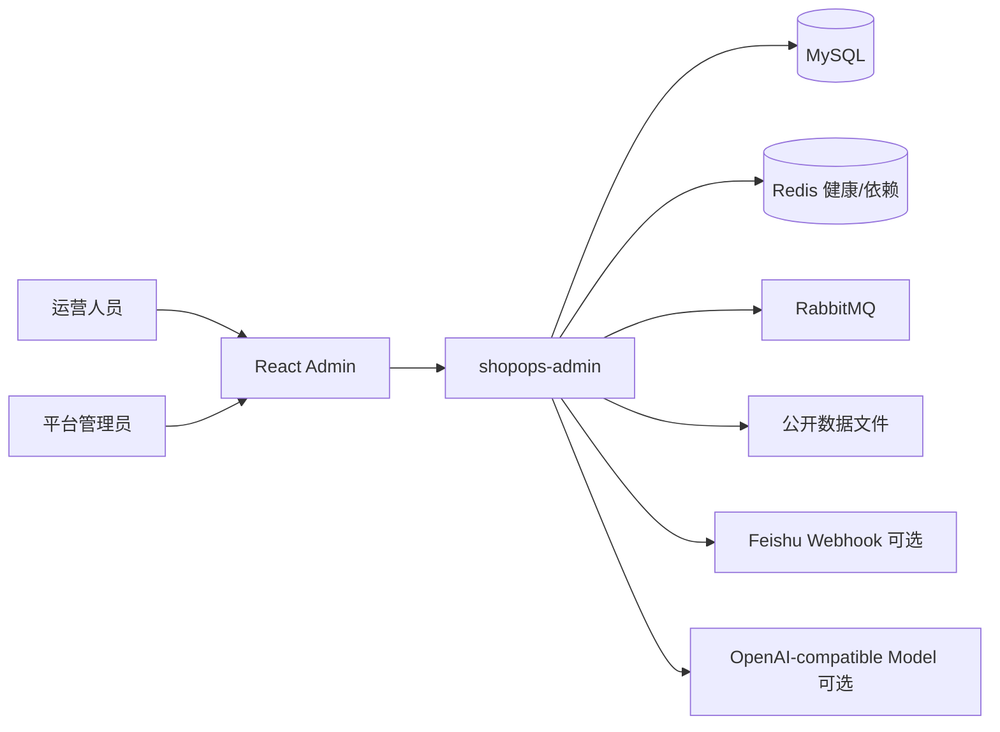
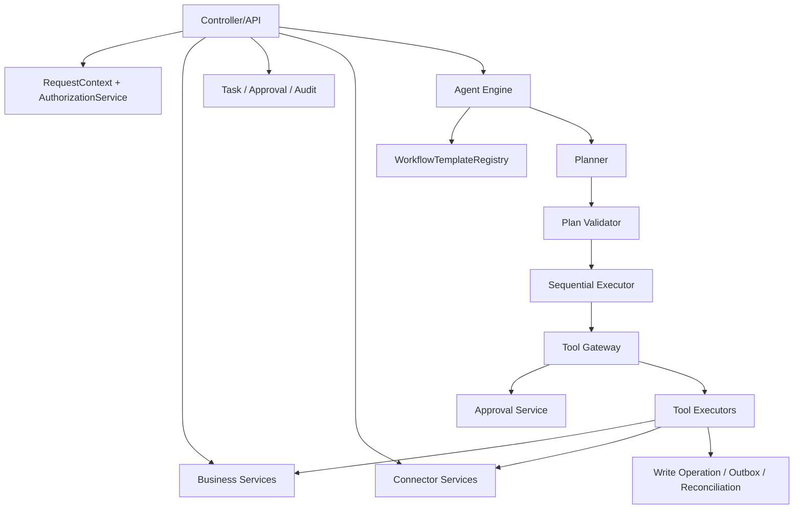
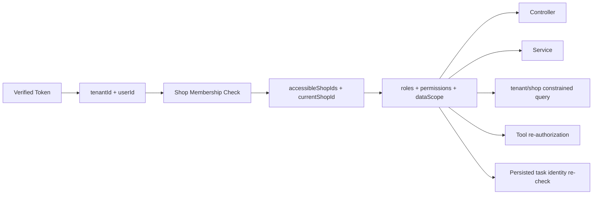
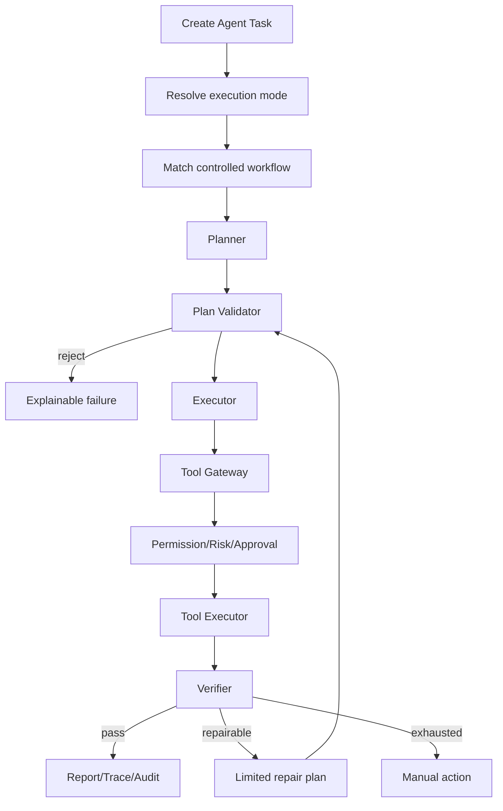
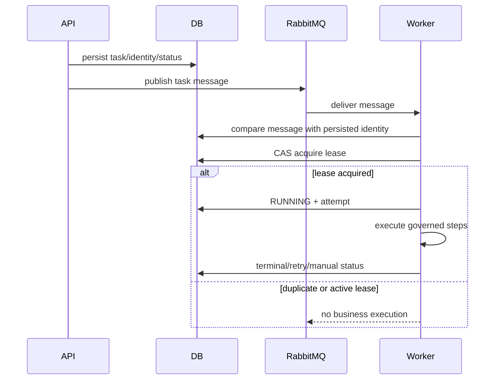
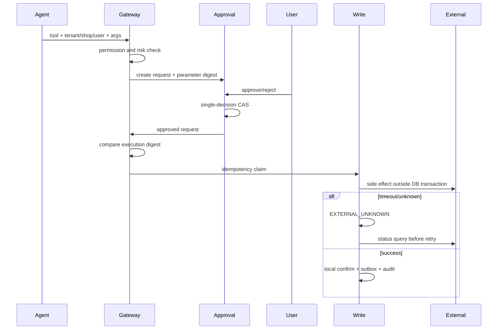
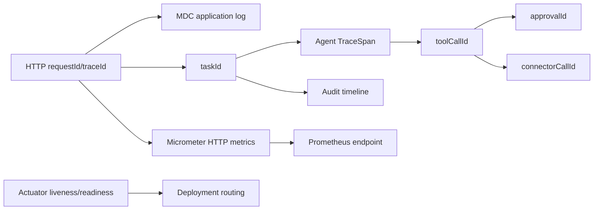

# ShopOps 架构与关键链路

本文只描述当前仓库中实际存在的模块和阶段 0—6 已接入的治理能力。

## 1. 系统上下文

## 2. 模块架构

## 3. 数据与租户边界

前端传入的 tenantId、userId 和 role 不能成为后端可信身份。当前 shopId 是用户选择上下文，必须通过成员关系检查。

## 4. Agent 工作流

## 5. 异步任务时序

当前发布仍存在需要 Outbox/confirm 继续完善的部分，周期心跳和完整自动接管尚未全部打通。

## 6. 高风险审批时序

## 7. 连接器同步

```mermaid
flowchart LR
  Config[Connector config] --> Credential[Encrypted credential]
  Credential --> Read[File/API client]
  Read --> Page[Page + cursor]
  Page --> Validate[Mapping/basic validation]
  Validate --> Fingerprint[External ID + SHA-256]
  Fingerprint --> Upsert[Unique-key UPSERT]
  Upsert --> Checkpoint[Cursor/checkpoint]
  Checkpoint --> Log[Sync state/API log/audit]
```

当前深度实现是 `file.order-summary`，数据进入同步暂存记录，不直接污染核心订单表。

## 8. 可观测性链路

当前不是完整 OpenTelemetry 分布式 Trace；RabbitMQ W3C Trace Context 传播仍待补充。
